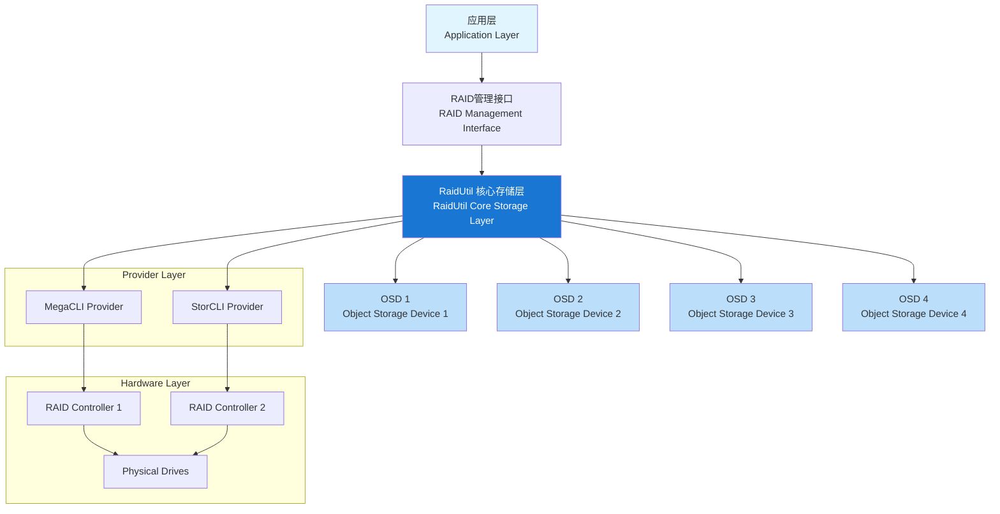

# RaidUtil 系统架构

## 系统架构图



## 架构说明

### 应用层 (Application Layer)
- 提供统一的用户接口
- 支持命令行工具调用
- 处理用户请求和响应

### 核心存储层 (RaidUtil Core Storage Layer)
- **统一接口抽象**: 提供统一的RAID操作接口
- **Provider管理**: 管理不同的RAID工具适配器
- **状态管理**: 维护RAID设备状态信息

### Provider层
- **MegaCLI Provider**: 适配MegaRAID控制器
- **StorCLI Provider**: 适配StorCLI控制器

### OSD层 (Object Storage Device)
每个OSD代表一个存储对象设备，提供：
- 物理驱动器状态监控
- 虚拟驱动器管理
- RAID配置管理
- 错误计数和健康状态

### 硬件层
- **RAID控制器**: 物理RAID控制器设备
- **物理驱动器**: 实际的存储设备

## 核心组件

### 1. RaidUtils接口
```go
type RaidUtils interface {
    GetControllerCount() (count int, err error)
    Get() (err error)
    GetPhysicalDrive(controller int) ([]PhysicalDriveStat, error)
    GetVirtualDrive(controller int) ([]VirtualDriveStat, error)
    CreateRaid(controller int, raidType int, name string, size string, drivers string, cache string, wtype string, pdperarray int) error
    DelRaid(controller int, vd int) error
    InitRaid(controller int, vd int, full bool) error
}
```

### 2. 数据结构
- **RaidType**: RAID类型配置
- **AdapterStat**: 适配器状态统计
- **VirtualDriveStat**: 虚拟驱动器状态
- **PhysicalDriveStat**: 物理驱动器状态

### 3. 支持的操作
- 获取控制器数量
- 查询物理/虚拟驱动器状态
- 创建/删除RAID阵列
- 初始化RAID
- 健康状态监控

## 扩展性
系统设计支持通过Provider模式轻松扩展新的RAID管理工具：
1. 实现RaidUtils接口
2. 在providers包中注册新的provider
3. 无需修改核心逻辑即可支持新的硬件

## 使用示例
```go
rt := v1.RaidType{
    Type:    "stor",
    BinPath: "/opt/MegaRAID/storcli/storcli64",
}
provider, err := providers.NewRaidProvider(&rt)
if err != nil {
    log.Fatal(err)
}
err = provider.Get()
```